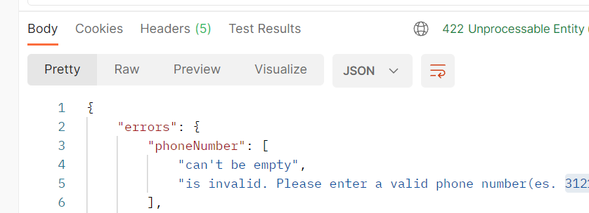

# RealWorld API Request Validation and Exception Handling

Let’s validate incoming requests in our APIs

## JSON Objects returned by API:

Make sure the right content type like `Content-Type: application/json; charset=utf-8` is correctly returned.


## DTO Layer: UserRequestDTO:

Here we can define various custom messages for each field of the request. Let's take a look at the code:

```Java
@Data
@Builder
public class UserRequestDTO {

    @NotBlank(message = "can't be empty")
    @NotNull(message = "is required. Please complete this field to continue.")
    @Size(min = 3, max = 30, message = "is invalid. Please use between 3 and 30 characters")
    String username;

    @NotBlank(message = "can't be empty")
    @Email(message = "is invalid. Please enter a valid email ")
    String email;

    @NotBlank(message = "can't be empty")
    @NotNull(message = "can't be null")
    String bio;

    @NotBlank(message = "can't be empty")
    @NotNull(message = "can't be null")
    @Pattern(regexp = "^((00|\\+)39[\\. ]??)??3\\d{2}[\\. ]??\\d{6,7}$",message = "is invalid. Please enter a valid phone number(es. 3121234567) ")
    String phoneNumber;

    @Min(value = 1, message = "is invalid. Equals to zero or less than zero")
    @Max(value = 100, message = "is invalid. Exceeds 100 years")
    Integer age;
}
```

### Registration:

`POST /api/users`

Example request body: case: 1
```JSON
{
  "user": {
    "email": "Provinciale@gmail.com",
    "username": "Provinciale",
    "phoneNumber": "3121234567",
    "bio": "I work at statefarm",
    "age": 15
  }
}
```

Example request body: case: 2

```JSON
{
  "username": "Provinciale",
  "email": "Provinciale@gmail.com",
  "bio": "I work at statefarm",
  "phoneNumber": "3121234567",
  "age": 15
}
```

No authentication required, returns a [User](#users-for-authentication)

Required fields: `email`, `username`, `phoneNumber`, `bio`, `age`


### Errors and Status Codes

If a request fails any validations, expect a 422 and errors in the following format:

```JSON
{
  "errors": {
    "phoneNumber": [
      "can't be empty",
      "is invalid. Please enter a valid phone number(es. 3121234567) "
    ],
    "age": [
      "is invalid. Equals to zero or less than zero"
    ],
    "email": [
      "can't be empty"
    ],
    "username": [
      "is invalid. Please use between 3 and 30 characters",
      "can't be empty"
    ]
  }
}
```



### Errors Alternative Format

If a request fails any validations: case: 1

```JSON
{
  "status": 400,
  "error": "Bad Request",
  "message": "Validation error",
  "detailedMessages": [
    "'username' can't be empty",
    "'bio' can't be empty",
    "'username' is invalid. Please use between 3 and 30 characters",
    "'age' is invalid. Equals to zero or less than zero",
    "'phoneNumber' can't be empty",
    "'phoneNumber' is invalid. Please enter a valid phone number(es. 3121234567) ",
    "'email' can't be empty"
  ]
}
```

If a request fails any validations: case: 2

```JSON
{
  "errors": {
    "body": [
      "[email]  can't be empty",
      "[bio]  can't be empty",
      "[username]  is invalid. Please use between 3 and 30 characters",
      "[age]  is invalid. Equals to zero or less than zero",
      "[phoneNumber]  is invalid. Please enter a valid phone number(es. 3121234567) ",
      "[username]  can't be empty",
      "[phoneNumber]  can't be empty"
    ]
  }
}
```

If a request fails any validations: case: 3

```JSON
{
  "phoneNumber": "can't be empty",
  "bio": "can't be empty",
  "email": "can't be empty",
  "age": "is invalid. Equals to zero or less than zero",
  "username": "is invalid. Please use between 3 and 30 characters"
}
```

## Endpoints:

### Get Current User:

`POST /api/user`


